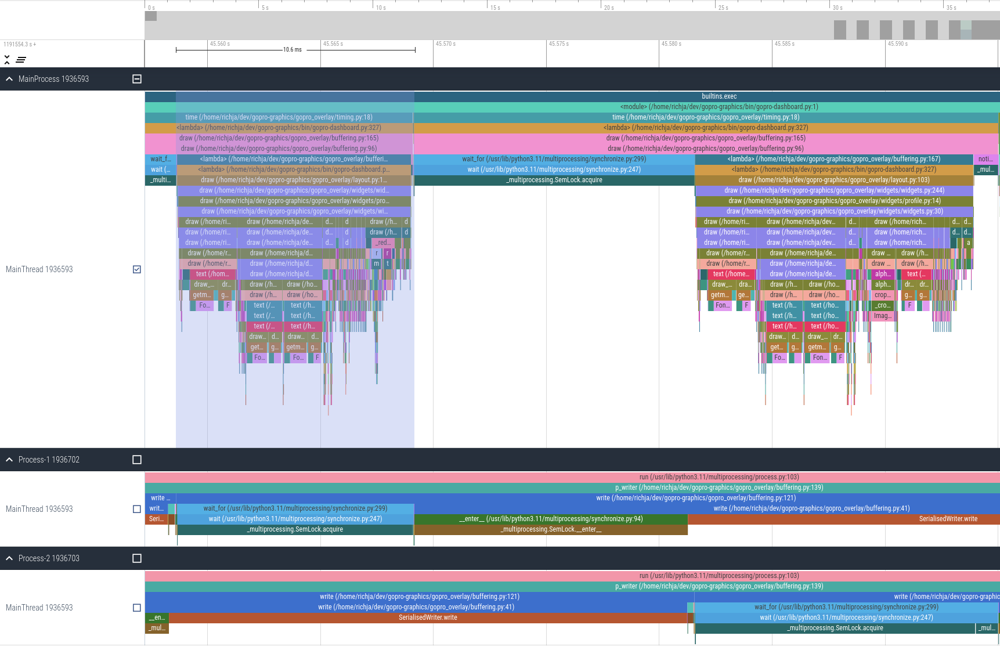
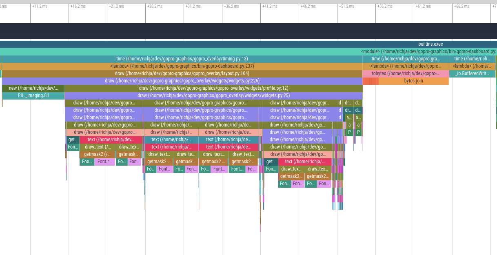
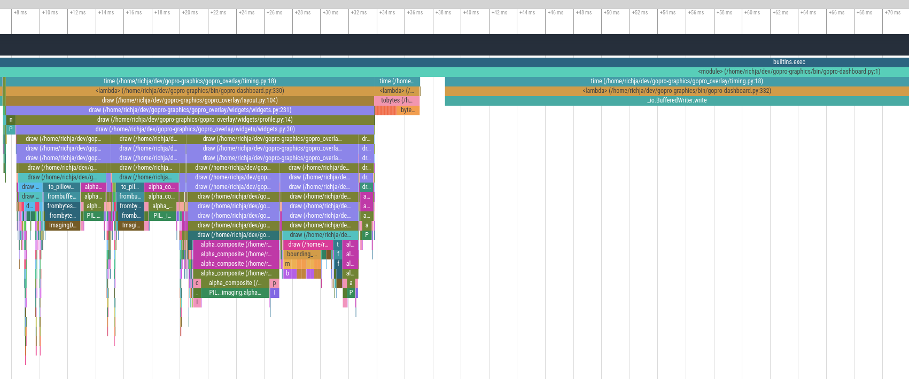
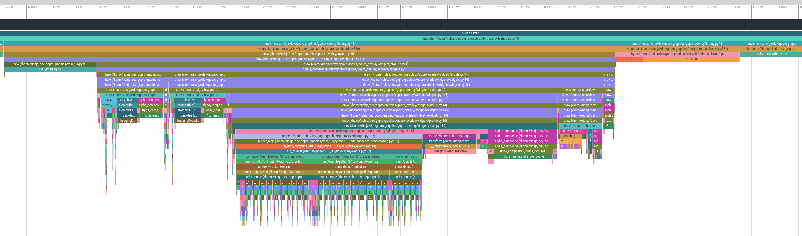
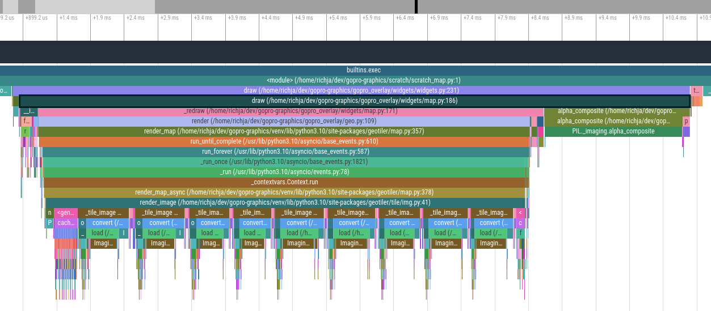
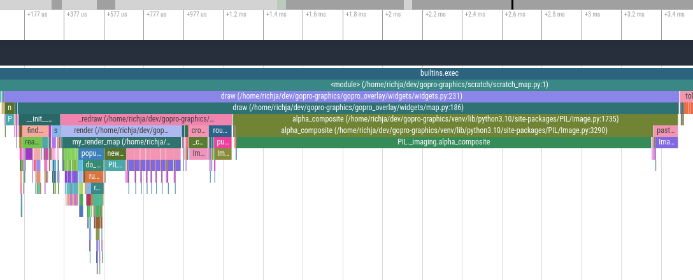

## Performance

Performance isn't really a major goal... Right now it processes video just a bit faster than realtime, so your 10 minute
video will probably take about 10 minutes to render. This is highly dependent on your CPU though.

For better performance, both the source and target files should be on a fast disk. Copy MP4 files from the SD card to local disk first - it will be much quicker. Use M2 drives if you have them.

The dashboard is updated every 0.1 seconds, regardless of the frame rate of the video, so 10 frames/s in this chart 
means 1 second of video is processed in 1 second.

There are a few levers to pull on to improve performance....

- Python Version - Later versions are getting some serious attention in performance. Use 3.11
- GPU - ffpmeg can use GPU for decoding and encoding. We have example settings for nvidia cards.
- Overlay mode - Processing "just" the dashboard is much faster than dashboard + movie, so if you just want to see how an overlay will look, this might be a good option.
- Double buffer mode - This new experimental mode can give great performance boost.

These indicative figures are from Ubuntu on Intel Core i7-6700K CPU @ 4.00GHz with NVIDIA GeForce GTX 3060, generating
the default overlay on 1920x1080 movie.


| Performance Option    | Frames/s "null"<br/>single/double | Frames/s normal<br/>single/double | Frames/s --profile nvgpu<br/>single/double |
|-----------------------|-----------------------------------|-----------------------------------|--------------------------------------------|
| Default (python 3.11) | ~29   /  ~36                      | ~18 / ~20                         | ~25  / ~33                                 | 
| Default + Pillow SIMD | ~66  / ~130                       | ~20 / ~21                         | ~44  / ~47                                 |

Using Pillow SIMD here, can see that double buffer mode doesn't make a huge difference, we are waiting for ffmpeg. On this
computer it takes 23ms to read a frame from stdin.. but that frame was generated in only 10ms so potentially with faster GPU this can be improved?

### GPU

Using the `--profile` option you can get a lot of extra performance out of the software. Please see the section on 
FFMPEG profiles in [docs/bin](docs/bin)

### Pillow-SIMD

You might be able to get some more performance out of the program by using pillow-simd. Installing it is a bit more
complicated. You'll need a compiler etc. Follow the installation instructions
at https://github.com/uploadcare/pillow-simd#pillow-simd

Short version:
```bash
venv/bin/pip uninstall pillow
venv/bin/pip install pillow-simd==9.0.0.post1
```
The frame drawing rate is quite a bit faster, but won't make a huge difference unless GPU settings are used with ffmpeg.

No tests are run in this project with pillow-simd, so output may vary (but their tests are good, so I wouldn't expect any huge differences, if any)

### Current Frame Timings



### Older Timings








### Things done

#### Double Buffer Mode

Use shared memory area for backing image, and use python subprocess to write this to ffmpeg.

#### Chart Performance Improvement

Recalculate this better...

#### Cache map tile images in memory

Before 





