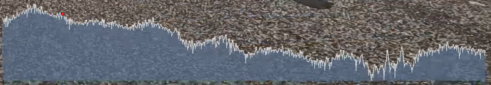
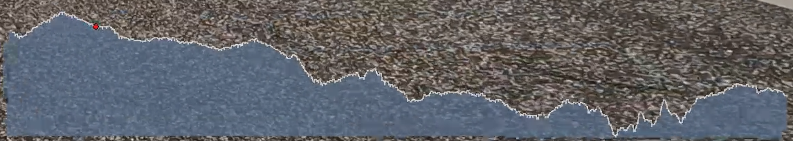

# Create video overlays from GoPro Videos or any GPX/FIT file

<a href="https://github.com/time4tea/gopro-dashboard-overlay/discussions"></a>
<a href="https://pypi.org/project/gopro-overlay/"></a>
<a href="https://hub.docker.com/r/overlaydash/gopro-dashboard-overlay"></a>

Discuss on [GitHub Discussions](https://github.com/time4tea/gopro-dashboard-overlay/discussions)

- Overlaying exciting graphics onto GoPro videos with super-exact synchronization
- Create videos from any GPX or FIT file - no GoPro required
- Support multiple resolutions, most GoPro models, normal, timelapse & timewarp modes
- Support GPUs to create movies at up to 17x realtime
- Convert GoPro movie metadata to GPX or CSV files
- Cut sections from GoPro movies (including metadata)
- Linux, Mac, Windows!

## Examples


An Example of 'overlay only' mode, which generates movies from GPX files


Example from [examples/layout](examples/layout)


## Map Styles

Almost 30 different map styles are supported! - See [map styles](docs/maps/README.md) for more

*Example*

| .                                   | .                                             | .                                                     | .                                                     |
|-------------------------------------|-----------------------------------------------|-------------------------------------------------------|-------------------------------------------------------|
|  |  |  |  |


## Requirements

- Python3.10 (development is done on Python3.11)
- ffmpeg (you'll need the ffmpeg program installed)
- libraqm (needed by [Pillow](https://pypi.org/project/Pillow/))

## Installation

For Windows, please see docs [docs/windows.md](docs/windows.md)

For Docker, please see docs at [docs/docker.md](docs/docker.md)

Install locally using `pip`, or use the provided Docker image

Optional: Some widgets require the `cairo` library - which must be installed separately.


### Installing and running with pip

```shell
python -m venv venv
venv/bin/pip install gopro-overlay
```

The Roboto font needs to be installed on your system. You could install it with one of the following commands maybe.

```bash
pacman -S ttf-roboto
apt install truetype-roboto
apt install fonts-roboto
```

#### (Optional) Installing pycairo

Optionally, install `pycairo`

```shell
venv/bin/pip install pycairo==1.23.0
```

You might need to install some system libraries - This is what the pycairo docs suggest: 

Ubuntu/Debian: `sudo apt install libcairo2-dev pkg-config python3-dev`

macOS/Homebrew: `brew install cairo pkg-config`

### Example

For full instructions on all command lines see [docs/bin](docs/bin)

```shell
venv/bin/gopro-dashboard.py --gpx ~/Downloads/Morning_Ride.gpx --privacy 52.000,-0.40000,0.50 ~/gopro/GH020073.MP4 GH020073-dashboard.MP4
```

## Caveats

The GPS track in Hero 9 seems to be very poor. If you supply a GPX file from a Garmin or whatever, the
program will use this instead for the GPS. Hero 11 GPS is much improved.

Privacy allows you to set a privacy zone. Various widgets will not draw points within that zone.

The data recorded in the GoPro video will uses GPS time, which (broadly) is UTC. The renderer will use your local
timezone to interpret this, and use the local timezone. This may produce strange results if you go on holiday somewhere,
but then render the files when you get back home! On linux you can use the TZ variable to change the timezone that's
used.

## Writeups

There's a great writeup of how to use the software to make an overlay from a GPX file at https://blog.cubieserver.de/2022/creating-gpx-overlay-videos-on-linux/
(Nov 2022)

### Format of the Dashboard Configuration file

Several dashboards are built-in to the software, but the dashboard layout is highly configurable, controlled by an XML
file.

For more information on the (extensive) configurability of the layout please see [docs/xml](docs/xml) and lots
of [examples](docs/xml/examples/README.md)

## FFMPEG Control & GPUs

FFMPEG has **a lot** of options! This program comes with some mostly sensible defaults, but to use GPUs and control the
output much more carefully, including framerates and bitrates, you can use a JSON file containing a number of 'profiles'
and select the profile you want when running the program.

For more details on how to select these, and an example of Nvidia GPU, please see the guide in [docs/bin#ffmpeg-profiles](docs/bin#ffmpeg-profiles)

Please also see other docs [PERFORMANCE.md](PERFORMANCE.md) and [docs/bin/PERFORMANCE_GUIDE.md](docs/bin/PERFORMANCE_GUIDE.md)

## Converting to GPX files

```shell
venv/bin/gopro-to-gpx.py <input-file> [output-file]
```

## Joining a sequence of MP4 files together

Use the gopro-join.py command. Given a single file from the sequence, it will find and join together all the files. If
you have any problems with this, please do raise an issue - I don't have that much test data.

The joined file almost certainly won't work in the GoPro tools! - But it should work with `gopro-dashboard.py` - I will
look into the additional technical stuff required to make it work in the GoPro tools.

*This will require a lot of disk space!*

```shell
venv/bin/gopro-join.py /media/sdcard/DCIM/100GOPRO/GH030170.MP4 /data/gopro/nice-ride.MP4
```

## Cutting a section from a GoPro file

You can cut a section of the gopro file, with metadata.

## Related Software

- https://github.com/julesgraus/interactiveGoProDashboardTool - An interactive helper to build the command line for the dashboard program

## Known Bugs / Issues

- Only tested on a GoPro Hero 9/11, that's all I have. Sample files for other devices are welcomed.

## Icons

Icon files in [icons](gopro_overlay/icons) are not covered by the MIT licence

## Map Data

Data © [OpenStreetMap contributors](http://www.openstreetmap.org/copyright)

Some Maps © [Thunderforest](http://www.thunderforest.com/)

## References

https://github.com/juanmcasillas/gopro2gpx

https://github.com/JuanIrache/gopro-telemetry

https://github.com/gopro/gpmf-parser

https://coderunner.io/how-to-compress-gopro-movies-and-keep-metadata/

## Other Related Software

https://github.com/progweb/gpx2video

https://github.com/JuanIrache/gopro-telemetry

## Latest Changes

If you find any issues with new releases, please discuss in [GitHub Discussions](https://github.com/time4tea/gopro-dashboard-overlay/discussions)
- 0.122.0 [Breaking] Previous change announced in v0.100.0 wasn't actually taking effect. Use --gpx-merge OVERWRITE to prefer values in gpx to gopro.
- 0.121.0 [Enhancement] Build in some simple ffmpeg profiles - `nvgpu`, `nnvgpu`, `mov`, `vp8`, and `vp9` - see [docs/bin#ffmpeg-profiles](docs/bin#ffmpeg-profiles)
- 0.120.0 [Fix] Resolve some Python3.10 compatibility issues. Thanks, [@KyleGW](https://github.com/KyleGW)
- 0.119.0 [PyPI Changes Only] Update README in PyPI so links should work
- 0.118.0 [Enhancement] Local Map Tiles are now cached in memory, so hugely more performant (affects `--map-style local` only)
- 0.117.0 [Enhancements] Tentative support for Python 3.12. Thanks to [@JimmyS83](https://github.com/JimmyS83) for the suggestion. Also some small bugfixes for waiting for ffmpeg, and also hopefully removing error message about shared memory using `--double-buffer`
- 0.116.0 [Docker Changes Only] Support GPU in docker image. See [docs/docker.md](docs/docker.md) Thanks to [@danielgv93](https://github.com/danielgv93) for suggestion.
- 0.115.0 [Fix] Previous smoothing had some issues - hopefully sorted. Many thanks to [@neri14](https://github.com/neri14) for pointing this out. Fixed possible issue with ffmpeg exiting before writing MOOV - sometimes could result in unplayable MP4 files.
- 0.114.0 [Enhancement] Huge Improvement to usability of speed gauges! - Speed was not being smoothed. Now a kalman filter is applied to speed, giving a much better result.
See below for before and after. This stops the speed gauges flickering between values. 
- [Breaking/Minor] Removed the decimal values for altitude & gradient in the default layouts - they were distracting as they changed too much.

 
 

- 0.113.0 [Enhancement] Add arc gauge - See [Arc Gauge Docs](docs/xml/examples/06-cairo-gauge-arc-annotated/README.md) for examples
- 0.112.0 [Enhancement] Show loading speed of gopro data.
- 0.111.0 [Fix] Simple Fix for #157 - timeout when reading large data files. Thanks to [@rpoxo](https://github.com/rpoxo) for raising.  
- 0.110.0 [Fix] Hopefully make the 'pace' units more robust. New metric format "pace".
- 0.109.0 [Feature] Support for new GPS9 data type - should give more accurate GPS. Supported on Hero11+
- 0.108.0 [Fix] GPX/GoPro overlay date checking had been broken for a while. Thanks (very much) to [@IbnGit](https://github.com/IbnGit) for raising
- 0.107.0 [Feature] New units! - "spm" - steps per minute, and "pace" - see [metrics docs](docs/xml/examples/04-metrics/README.md) for full explanation Thanks [@SlippyJimmy](https://github.com/SlippyJimmy)
- 0.106.0 [Feature] New map style "cyclosm" - see: https://www.cyclosm.org/ - An OpenStreetmap for cycling - See map examples for more
- 0.105.0 [Behaviour Change]  Fix [#150](https://github.com/time4tea/gopro-dashboard-overlay/issues/150) cairo circuit map aspect raio is wrong. Thanks [@yuanduopeng](https://github.com/yuanduopeng) for raising.
- 0.104.0 [Fix] Honour cmdline arg `--show-ffmpeg`

Older changes are in [CHANGELOG.md](CHANGELOG.md)

