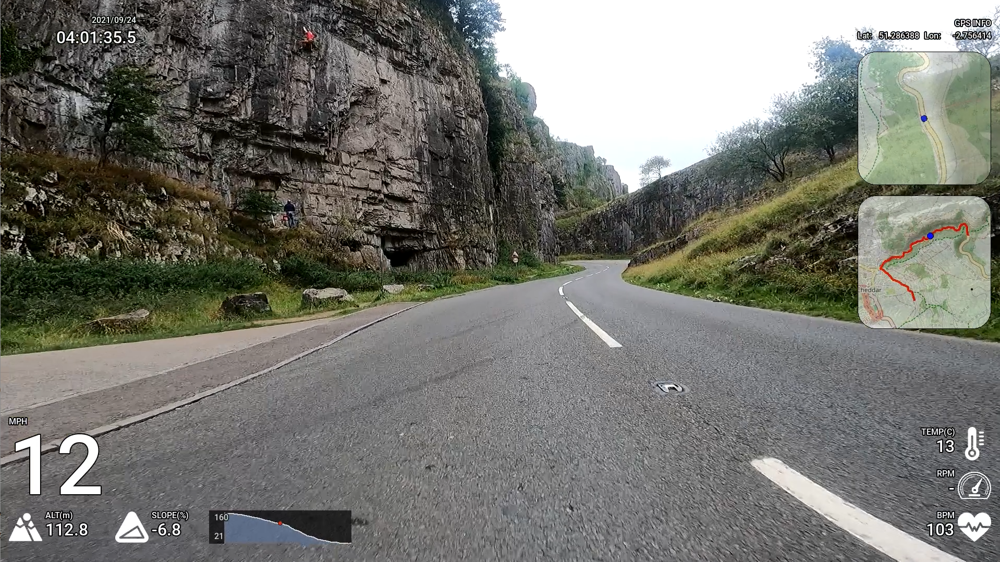
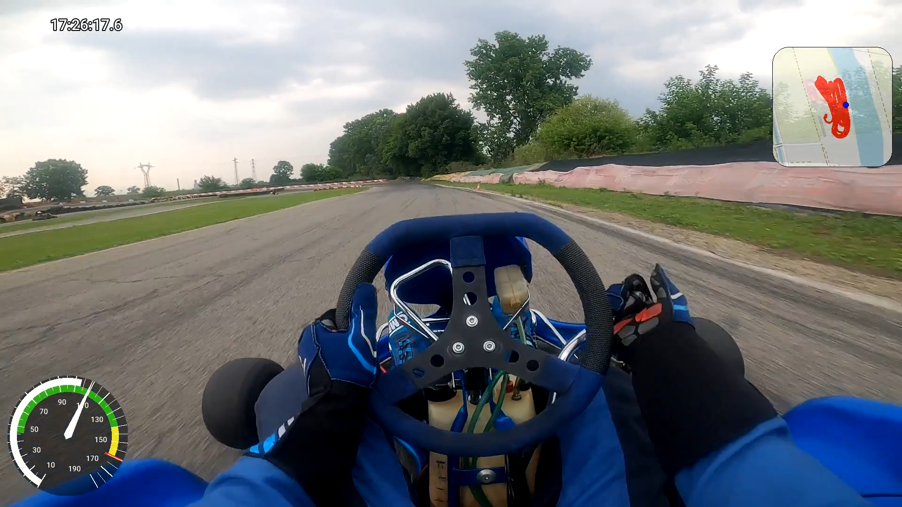
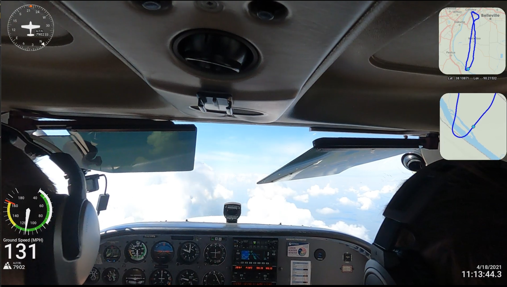
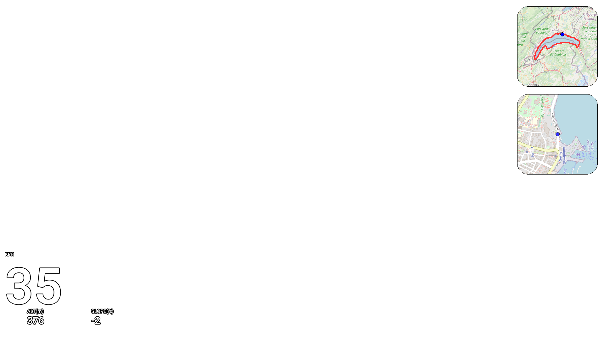
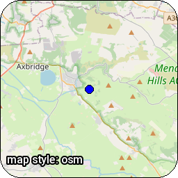
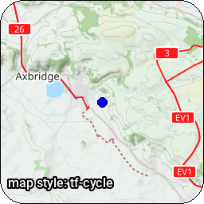
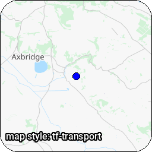
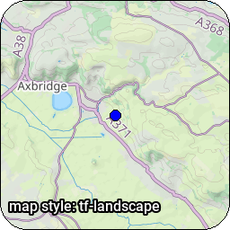

# Create video overlays from GoPro Videos or any GPX/FIT file

<a href="https://github.com/time4tea/gopro-dashboard-overlay/discussions"></a>
<a href="https://pypi.org/project/gopro-overlay/"></a>
<a href="https://hub.docker.com/r/overlaydash/gopro-dashboard-overlay"></a>

Discuss on [GitHub Discussions](https://github.com/time4tea/gopro-dashboard-overlay/discussions)

- Overlaying exciting graphics onto GoPro videos with super-exact synchronization
- Create videos from any GPX file - no GoPro required
- Support multiple resolutions, most GoPro models, normal, timelapse & timewarp modes
- Convert GoPro movie metadata to GPX or CSV files
- Cut sections from GoPro movies (including metadata)

## Examples





An Example of 'overlay only' mode, which generates movies from GPX files


Example from [examples/layout](examples/layout)


## Map Styles

Almost 30 different map styles are supported! - See [map styles](docs/maps/README.md) for more

*Example*

| .                                   | .                                             | .                                                     | .                                                     |
|-------------------------------------|-----------------------------------------------|-------------------------------------------------------|-------------------------------------------------------|
|  |  |  |  |


## Requirements


- Python3.10 (development is done on Python3.11)
- ffmpeg (you'll need the ffmpeg program installed)
- libraqm (needed by [Pillow](https://pypi.org/project/Pillow/))
- Unixy machine (probably, untested on Windows)

## Installation

Install locally using `pip`, or use the provided Docker image

Optional: Some widgets require the `cairo` library - which must be installed separately.

### Installing and running with docker

The docker image is a new thing and still a bit experimental... please file an issue if you find any problems.

The docker image contains all you need to get started, and uses a volume `/work/`, which we suggest you map to the current directory which can contain your GoPro
files. Note that the docker version doesn't support nvidia GPU extensions.

The most recent version on docker is: <a href="https://hub.docker.com/r/overlaydash/gopro-dashboard-overlay"></a>

```shell
docker run -it -v "$(pwd):/work" overlaydash/gopro-dashboard-overlay:<version> <program> [args...]
```

e.g.

```shell
docker run -it -v "$(pwd):/work" overlaydash/gopro-dashboard-overlay:0.92.0 gopro-dashboard.py GH010122.MP4 render/docker.MP4
```

Files created by the program will be created with the same uid that owns the mapped directory.

You can use the `--cache-dir` and `--config-dir` command line arguments to configure where the cache and config dirs are,
thereby making it easier to use persistent mapped volumes.


### Installing and running with pip

```shell
python -m venv venv
venv/bin/pip install gopro-overlay
```

The Roboto font needs to be installed on your system. You could install it with one of the following commands maybe.

```bash
pacman -S ttf-roboto
apt install truetype-roboto
apt install fonts-roboto
```

#### (Optional) Installing pycairo

Optionally, install `pycairo`

```shell
venv/bin/pip install pycairo==1.23.0
```

You might need to install some system libraries - This is what the pycairo docs suggest: 

Ubuntu/Debian: `sudo apt install libcairo2-dev pkg-config python3-dev`

macOS/Homebrew: `brew install cairo pkg-config`


## Overlaying a dashboard

```shell
venv/bin/gopro-dashboard.py
```

The GPS track in Hero 9 (at least) seems to be very poor. If you supply a GPX file from a Garmin or whatever, the
program will use this instead for the GPS.

Privacy allows you to set a privacy zone. Various widgets will not draw points within that zone.

The data recorded in the GoPro video will uses GPS time, which (broadly) is UTC. The renderer will use your local
timezone to interpret this, and use the local timezone. This may produce strange results if you go on holiday somewhere,
but then render the files when you get back home! On linux you can use the TZ variable to change the timezone that's
used.

### Example

For full instructions on all command lines see [docs/bin](docs/bin)

```shell
venv/bin/gopro-dashboard.py --gpx ~/Downloads/Morning_Ride.gpx --privacy 52.000,-0.40000,0.50 ~/gopro/GH020073.MP4 GH020073-dashboard.MP4
```

## Writeups

There's a great writeup of how to use the software to make an overlay from a GPX file at https://blog.cubieserver.de/2022/creating-gpx-overlay-videos-on-linux/
(Nov 2022)

### Format of the Dashboard Configuration file

Several dashboards are built-in to the software, but the dashboard layout is highly configurable, controlled by an XML
file.

For more information on the (extensive) configurability of the layout please see [docs/xml](docs/xml) and lots
of [examples](docs/xml/examples/README.md)

## FFMPEG Control & GPUs

*Experimental*

FFMPEG has **a lot** of options! This program comes with some mostly sensible defaults, but to use GPUs and control the
output much more carefully, including framerates and bitrates, you can use a JSON file containing a number of 'profiles'
and select the profile you want when running the program.

For more details on how to select these, and an example of Nvidia GPU, please see [docs/bin/PERFORMANCE_GUIDE.md](docs/bin/PERFORMANCE_GUIDE.md)

Please also see [PERFORMANCE.md](PERFORMANCE.md)

## Converting to GPX files

```shell
venv/bin/gopro-to-gpx.py <input-file> [output-file]
```

## Joining a sequence of MP4 files together

Use the gopro-join.py command. Given a single file from the sequence, it will find and join together all the files. If
you have any problems with this, please do raise an issue - I don't have that much test data.

The joined file almost certainly won't work in the GoPro tools! - But it should work with `gopro-dashboard.py` - I will
look into the additional technical stuff required to make it work in the GoPro tools.

*This will require a lot of disk space!*

```shell
venv/bin/gopro-join.py /media/sdcard/DCIM/100GOPRO/GH030170.MP4 /data/gopro/nice-ride.MP4
```

## Cutting a section from a GoPro file

You can cut a section of the gopro file, with metadata.

## Related Software

- https://github.com/julesgraus/interactiveGoProDashboardTool - An interactive helper to build the command line for the dashboard program

## Known Bugs / Issues

- Only tested on a GoPro Hero 9/11, that's all I have. Sample files for other devices are welcomed.

## Icons

Icon files in [icons](gopro_overlay/icons) are not covered by the MIT licence

## Map Data

Data © [OpenStreetMap contributors](http://www.openstreetmap.org/copyright)

Some Maps © [Thunderforest](http://www.thunderforest.com/)

## References

https://github.com/juanmcasillas/gopro2gpx

https://github.com/JuanIrache/gopro-telemetry

https://github.com/gopro/gpmf-parser

https://coderunner.io/how-to-compress-gopro-movies-and-keep-metadata/

## Other Related Software

https://github.com/progweb/gpx2video

https://github.com/JuanIrache/gopro-telemetry

## Latest Changes

If you find any issues with new releases, please discuss in [GitHub Discussions](https://github.com/time4tea/gopro-dashboard-overlay/discussions)
- 0.94.0 [Change] Update docker image to python3.11/ffmpeg 6.0 
- 0.93.0 [Feature] Support for *fully gpu* decoding/overlay/encoding. Huge performance increase now possible. It takes a bit of work, but now can render at 12x realtime. See [docs/bin/PERFORMANCE_GUIDE.md](docs/bin/PERFORMANCE_GUIDE.md)
  - [Breaking] Remove support for `--output-size` as it didn't really work properly anyway. 
- 0.92.0 [Feature] `--double-buffer` - EXPERIMENTAL double-buffering. Potentially much faster rendering, but may not work on all architectures. Speed improvements highly dependent on `ffmpeg` performance. Likely much faster when using `--generate overlay`. Feedback welcomed.
- 0.91.0 [Fix] Ignore FIT data items that don't have a GPS location. [#122](https://github.com/time4tea/gopro-dashboard-overlay/issues/122) Thanks [@patkoscsaba](https://github.com/patkoscsaba) for raising.
- 0.90.0 [Change] `cairo-circuit` now draws much more quickly. 
- [Change] Map rendering caches tile images more efficiently, so draws more quickly.
- 0.89.0 [Feature] New component `cairo-gauge-round-annotated` - A bit like a car speedometer - See docs [docs/xml/examples/06-cairo-gauge-round-annotated](docs/xml/examples/06-cairo-gauge-round-annotated)
- 0.88.0 [Fix] Journey Map broke when no there were no locked GPS points in the movie.
  - Thanks [@shahargli](https://github.com/shahargli) for reporting
- 0.87.0 [Fix/Breaking Possibly] `chart` - discovered a few bugs, now fixed. Removed `alpha`, instead use alpha of each colour.
- 0.86.0 [Feature] New component `cairo-gauge-marker` - a nice clean gauge component, with a marker for the current value.. See docs [docs/xml/examples/06-cairo-gauge-marker](docs/xml/examples/06-cairo-gauge-marker)
- 0.85.0 [Feature/Breaking Possibly] Add validation to attributes in layout files. This may cause some custom layouts to break! - But they wouldn't have been working as intended.
  - [Change/Breaking] Change some `zone-bar` attribute names, aiming for standardisation
  - [Change/Breaking] Change some `cairo-circuit-map` attribute names, aiming for standardisation
- 0.84.0 [Feature] New component `zone-bar` - a 3-zone bar control that can be used for HR/Cadence/Power zones. See docs in [docs/xml/examples/07-zone-bar](docs/xml/examples/07-zone-bar)
  - Many thanks to [@jchinte](https://github.com/jchinte) for contributing!
- 0.83.0 [Change] No longer require --overlay-size when using --use-gpx-only, but supplying input video
  - [Fix] Give better error message when video and GPX don't overlap in time, but told to sync 
  - Thanks to [@mfloryan](https://github.com/mfloryan) for reporting both of these
- 0.82.0 [Change] Support for changing units in layouts from the command line. Use `--units-speed` etc to control. Examples are in [docs/bin](docs/bin)
  - Thanks to [@matzeruegge](https://github.com/matzeruegge) for the suggestion.
- 0.81.0 [Fix] gopro-rename was broken when using `--dirs` - added tests so hopefully won't reoccur. Thanks to [matzeruegge](https://github.com/matzeruegge) for reporting 

Older changes are in [CHANGELOG.md](CHANGELOG.md)

