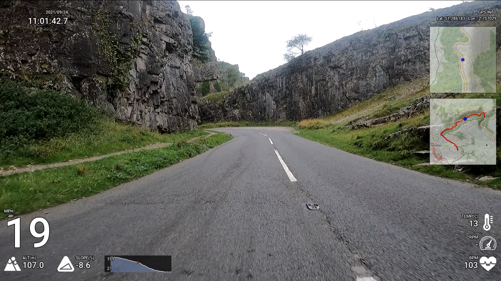

# Overlaying Dashboard onto GoPro MP4 Files

- Overlaying exciting graphics
- Converting to GPX files

## Examples



## Requirements

- Python3.8
- ffmpeg (you'll need the ffmpeg program installed)
- Unixy machine (probably, untested on Windows)


## How to use

- Install with pip

```shell
python -m venv venv
venv/bin/pip install gopro-overlay
```

## Converting to GPX files

```shell
venv/bin/gopro-to-gpx.py <input-file> [output-file]
```

## Overlaying a dashboard

```shell
venv/bin/gopro-dashboard.py
```


The GPS track in Hero 9 (at least) seems to be very poor. If you supply a GPX file from a Garmin or whatever, the 
program will use this instead for the GPS.

Privacy allows you to set a privacy zone. Various widgets will not draw points within that zone.

```
usage: gopro-dashboard.py [-h] [--font FONT] [--gpx GPX] [--privacy PRIVACY] [--no-overlay]
                          [--map-style {osm,tf-cycle,tf-transport,tf-landscape,tf-outdoors,tf-transport-dark,tf-spinal-map,tf-pioneer,tf-mobile-atlas,tf-neighbourhood,tf-atlas}]
                          [--map-api-key MAP_API_KEY] [--layout {default,speed-awareness,xml}] [--layout-xml LAYOUT_XML] [--show-ffmpeg]
                          [--output-size OUTPUT_SIZE]
                          input output

Overlay gadgets on to GoPro MP4

positional arguments:
  input                 Input MP4 file
  output                Output MP4 file

optional arguments:
  -h, --help            show this help message and exit
  --font FONT           Selects a font (default: Roboto-Medium.ttf)
  --gpx GPX             Use GPX file for location / alt / hr / cadence / temp (default: None)
  --privacy PRIVACY     Set privacy zone (lat,lon,km) (default: None)
  --no-overlay          Only output the gadgets, don't overlay (default: True)
  --map-style {osm,tf-cycle,tf-transport,tf-landscape,tf-outdoors,tf-transport-dark,tf-spinal-map,tf-pioneer,tf-mobile-atlas,tf-neighbourhood,tf-atlas}
                        Style of map to render (default: osm)
  --map-api-key MAP_API_KEY
                        API Key for map provider, if required (default OSM doesn't need one) (default: None)
  --layout {default,speed-awareness,xml}
                        Choose graphics layout (default: default)
  --layout-xml LAYOUT_XML
                        Use XML File for layout [experimental! - file format likely to change!] (default: None)
  --show-ffmpeg         Show FFMPEG output (not usually useful) (default: False)
  --output-size OUTPUT_SIZE
                        Vertical size of output movie (default: 1080)

```

### Example

```shell
venv/bin/gopro-dashboard.py --gpx ~/Downloads/Morning_Ride.gpx --privacy 52.000,-0.40000,0.50 ~/gopro/GH020073.MP4 GH020073-dashboard.MP4
```

## Joining a sequence of MP4 files together

Use the gopro-join.py command. Given a single file from the sequence, it will find and join together all the files.
If you have any problems with this, please do raise an issue - I don't have that much test data.

The joined file almost certainly won't work in the GoPro tools! - But it should work with `gopro-dashboard.py` - I will look into
the additional technical stuff required to make it work in the GoPro tools.

*This will require a lot of disk space!*

```shell
usage: gopro-join.py [-h] input output

Concatenate sequence of GoPro Files

positional arguments:
  input       A single MP4 file from the sequence
  output      Output MP4 file

optional arguments:
  -h, --help  show this help message and exit

```


## Performance

Performance isn't really a major goal... Right now it processes video just a bit faster than realtime, so your 10 minute video 
will probably take about 10 minutes to render. This is highly dependent on your CPU though. 


### Pillow-SIMD

You might be able to get some more performance out of the program by using pillow-simd. Installing it is a bit more complicated.
You'll need a compiler etc. Follow the installation instructions at https://github.com/uploadcare/pillow-simd#pillow-simd

On my computer, although for sure the frame-drawing is a bit faster ( 36fps v 25fps ), ffmpeg itself is the limiting factor, so 
overall it doesn't make much difference, it's 5 seconds faster for an 8-minute render. This is on an 4/8HT core Intel(R) Core(TM) i7-6700K CPU @ 4.00GHz (2015-Skylake),
if you have a lot more CPU cores it might make a bigger difference.

### FFMPEG GPU

My GPU isn't really new enough to use the GPU-enabled FFMPEG, so I can't test it out. If you have information to share about this, please do! 

## Known Bugs / Issues

- Only tested on a GoPro Hero 9, that's all I have. Sample files for other devices are welcomed.
- Aligning overlay with video - not exact! - Start garmin first, and wait for GPS lock before recording

## Controlling the dashboard layout / controlling widgets

XML Configuration file support - By using the parameters `--layout xml --layout-xml <filename>` you can get
configure the layout yourself.

Have a look at the [example file](gopro_overlay/layouts/example.xml) to see an example, or see the 
[default layout](gopro_overlay/layouts/default-1920x1080.xml) which now uses XML layout.

## Omitting Widgets

If the layout you are using has a widget you don't want, you can use `--include <name> <name>.. ` or `--exclude <name> <name>...`
on the command line to include or exclude that widget.  To get the name of the widget, currently you need to look at the xml file. (linked above)

## Icons

Icon files in [icons](gopro_overlay/icons) are not covered by the MIT licence

## Map Data

Data © [OpenStreetMap contributors](http://www.openstreetmap.org/copyright)

Some Maps © [Thunderforest](http://www.thunderforest.com/)

## References

https://github.com/juanmcasillas/gopro2gpx

https://github.com/JuanIrache/gopro-telemetry

https://github.com/gopro/gpmf-parser

https://coderunner.io/how-to-compress-gopro-movies-and-keep-metadata/

## Other Related Software

https://github.com/progweb/gpx2video

https://github.com/JuanIrache/gopro-telemetry


## Latest Changes
- 0.20.0
  - Add "opacity"  and "corner_radius" to maps xml components (H/T [@KyleGW](https://github.com/KyleGW))
  - New Utility: gopro-cut.py - Extract a section of a GoPro recording, with metadata
- 0.19.0
  - Load custom XML layouts correctly on command line. 
- 0.18.0
  - BUGFIX: pypi distribution was still broken. :-(
- 0.17.0
  - BUGFIX: pypi distribution was broken. :-(
- 0.16.0
  - Add support for degrees F for temp. 
- 0.15.0
  - XML Layouts improved. Probably good/stable enough to make custom layouts
  - Include/Exclude named components using command line
- 0.14.0
  - Fix for some thunderforest themes (H/T [@KyleGW](https://github.com/KyleGW))
  - XML layout support for vertical and colour text
- 0.13.0
  - Improved XML layout - text/metrics/unit conversions
- 0.12.0
  - New Utility: gopro-join.py - Join multiple GoPro files from a single session together 
  - Improve Parsing Speed for GoPro Metadata
- 0.11.0 
  - Allow XML layout definitions 
  