<!-- 

Auto Generated File DO NOT EDIT 

-->
# Map Styles

`gopro-dashboard.py` supports a number of map styles and providers.

The providers are:

- OSM/OpenStreetmap
- ThunderForest 
- Geoapify
- TianDiTu/天地图

# Selecting the Map Style

Use the command line option `--map-style` to choose the map style

Example:

`--map-style tf-cycle `

# (NEW) Per-Component Map Style

Since v0.127.0

It is now possible to set the map provider and style on a per-component basis. This can be done on the `moving_map`, `journey_map`, and `moving_journey_map` components by using the `map_style` attribute. If blank or omitted, the global map style (set with `--map-style`) will be used. Transparent map styles can be overlaid by using multiple components with different `map_style` attributes.

# API Keys

There are three ways that the API key can be supplied for the map. You'll need to sign up with the map provider.
The styles supported by the program all have free plans that are big enough to render a video. The program maintains a local
cache of the tiles.

### Command Line
API Keys can be provided on the command line, with `--api-key xxxxx`, 


### Totally Custom Map Tiles

Since v0.97.0

If you'd like to use a hand drawn map, or a scan of some printed map, or similar this can be done relatively straightforwardly.
To do this, get a high-resolution image of the map you'd like to use. It should be to scale... but the scale itself doesn't matter.

- Download the "maptiler engine" from https://www.maptiler.com/engine/download/
- Generate map tile locally, by opening the file, geolocating it, and exporting. Ensure to use *png* format.
- In a terminal window, go to the folder where the map tiles were exported, and run `python3 -mhttp.server`
- Use `--map-style local` when using `gopro-dashboard`
- You'll probably get a load of HTTP errors output, as this feature is experimental right now, but the video generation should work ok.

- See https://github.com/time4tea/gopro-dashboard-overlay/discussions/132 for more details.

### Configuration File

A file can be created `~/.gopro-graphics/map-api-keys.json`, which contains the api keys

Example

```json
{
        "thunderforest": "abcd1234",
        "geoapify": "1234abcd"
}
```

### Environment Variable

The environment will be searched for `API_KEY_<provider>`

Example:
`API_KEY_THUNDERFOREST=abcd1234`


# Style Examples

Here are examples of the various styles.

| .    | .            | . | . |
|------|--------------| --- | --- |
| 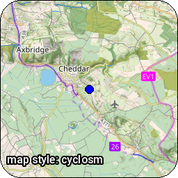 | 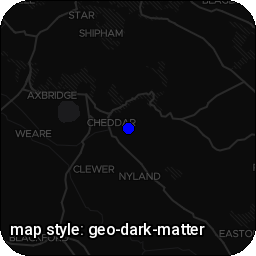 | 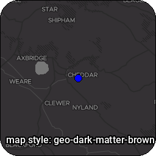 | 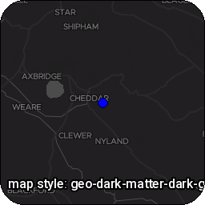 |
| 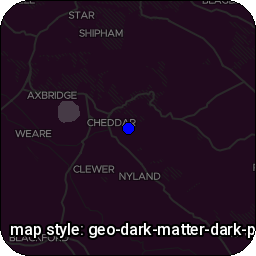 | 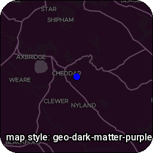 | 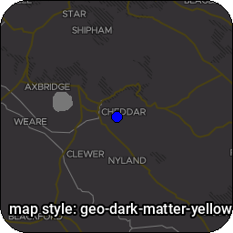 | 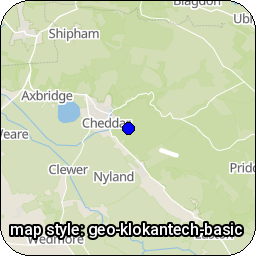 |
| 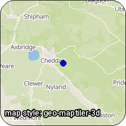 | 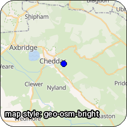 | 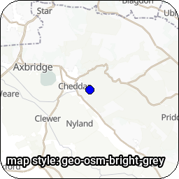 | 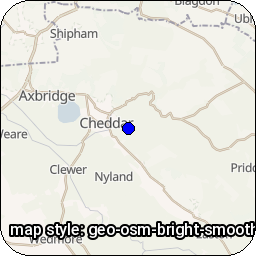 |
| 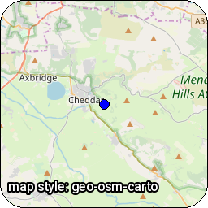 | 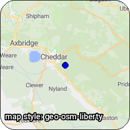 | 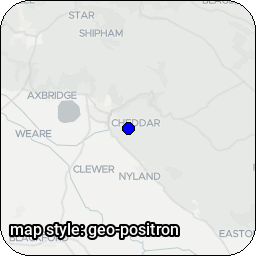 | 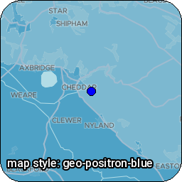 |
| 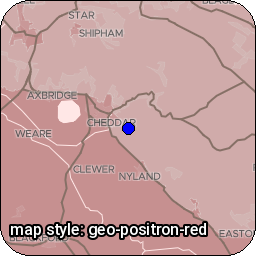 | 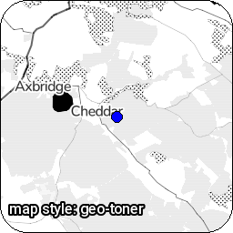 | 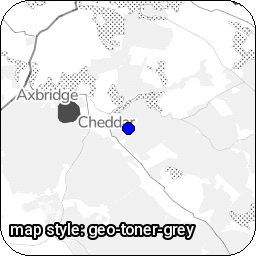 |  |
|  | 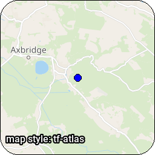 |  |  |
| 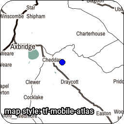 | 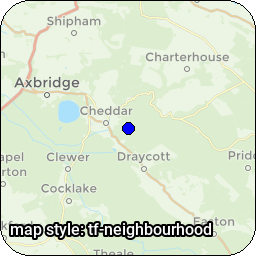 | 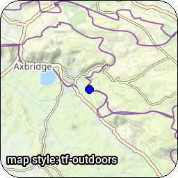 | 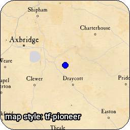 |
|  |  | 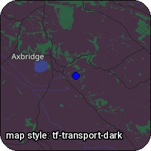 |  |

## Attribution

Please ensure that you attribute the map correctly

### CyclOSM 
 Maps © CyclOSM
https://www.cyclosm.org/ Data © OpenStreetMap contributors
http://www.openstreetmap.org/copyright

### Geoapify Map 
 Maps © Geoapify
https://www.geoapify.com/
Data © OpenStreetMap contributors
http://www.openstreetmap.org/copyright

### Local 
 Custom

### OpenStreetMap 
 © OpenStreetMap contributors
http://www.openstreetmap.org/copyright

### Thunderforest Map 
 Maps © Thunderforest
http://www.thunderforest.com/
Data © OpenStreetMap contributors
http://www.openstreetmap.org/copyright