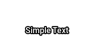

# Simple Text

The text to render is just the element contents


```xml
<component type="text">Simple Text</component>
```
<kbd></kbd>


## Positioning

Use `x` and `y` to position text on the dashboard


```xml
<component type="text" x="50" y="50">Simple Text</component>
```
<kbd></kbd>


## Colour

Use `rgb` to control the colour of the text 


```xml
<component type="text" rgb="255,255,0">Simple Text</component>
```
<kbd></kbd>
