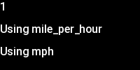

<!-- 

Auto Generated File DO NOT EDIT 

-->
# Metrics

Metrics are fields that are extracted or derived from the GoPro or GPX data.

The metric component draws the value of a bit of data on the screen at the given co-ordinate.


```xml
<component type="metric" metric="speed" />
```
<kbd></kbd>


## Conversions

Every metric knows its units, and can be converted to another unit easily. See [below](#supported-metrics) for the base unit
for each metric.


```xml
<component type="metric" metric="speed" />
```
<kbd></kbd>


```xml
<component type="metric" metric="speed" units="kph" />
```
<kbd></kbd>


```xml
<component type="metric" metric="speed" units="mph" />
```
<kbd></kbd>


```xml
<component type="metric" metric="speed" units="knots" />
```
<kbd></kbd>


```xml
<component type="metric" metric="speed" units="pace_km" />
```
<kbd></kbd>


The following units are supported:

| Dimension                        | Units                                                                               |
|----------------------------------|-------------------------------------------------------------------------------------|
| Speed                            | mph, kph, mps (metres-per-second), fps (feet-per-second), knots, knot,              |
| Pace (Minutes per distance-unit) | pace, pace_km, pace_mile, pace_kt                             | 
| Temperature                      | degreeF, degreeC, degreeK                                                           |
| Distance                         | mile, miles, m, metres, km, nmi (nautical mile), foot, yard, hand, angstrom, parsec |
| Acceleration                     | gravity, G, m/s^2, m/s²                                                             |
| Power                            | W, kW, watt, hp (UK horsepower)                                                     |
| Rotation                         | degrees, radians                                                                    |

`gravity` and `G` are synonyms for 9.80665 m/s², so will convert acceleration values to G's

Conversions that don't make sense for a given metric will fail with a suitable message.

## Controllable units

Some units can be controlled by the command line, so instead of using a particular unit, you can also use on eof the following

| Unit          | Meaning                            |
|---------------|------------------------------------|
| `speed`       | User-controllable speed unit       |
| `distance`    | User-controllable distance unit    |
| `temperature` | User-controllable temperature unit |
| `altitude`    | User-controllable altitude unit    |

Using these units, along with the `metric-unit` component, means that a single layout can serve for UK, EU and US measurements, or mixed unit layouts 
like distances in km, but altitude in feet (to give higher numbers if you are cycling!)


```xml
<component type="metric"      y="0" metric="speed" units="speed" dp="0" />
<component type="metric-unit" y="32" metric="speed" units="speed">Using {:P} </component>
<component type="metric-unit" y="64" metric="speed" units="speed">Using {:~P} </component>
```
<kbd></kbd>


## Lat & Lon

GPS Location is just another metric...

`cache="false"` is suggested for lat & lon metrics, as they will rarely repeat. By default text glyphs are cached, as they are
quite slow to render. This can be ignored really unless there are memory errors while rendering.


```xml
<component type="metric" metric="lat" dp="6" size="16" cache="false"/>
```
<kbd></kbd>


## Formatting

Either a number of decimal places, or a specific python formatting string can be used.

### Decimal Places

use the `dp` attribute


```xml
<component type="metric" metric="speed" dp="0" />
```
<kbd></kbd>


```xml
<component type="metric" metric="speed" dp="2" />
```
<kbd></kbd>


```xml
<component type="metric" metric="speed" dp="5" />
```
<kbd></kbd>


### Format string

Use the `format` attribute.


```xml
<component type="metric" metric="speed" format=".4f" />
```
<kbd></kbd>


## Positioning

The same positioning as in the [text](01-simple-text.md) component


```xml
<component type="metric" x="40" metric="speed" />
```
<kbd></kbd>


## Alignment

The same alignment as in the [text](01-simple-text.md) component


```xml
<component type="metric" x="40" metric="speed" align="right" />
```
<kbd></kbd>


## Colour

The same colour as in the [text](01-simple-text.md) component


```xml
<component type="metric" metric="speed" rgb="255,255,0" />
```
<kbd></kbd>


```xml
<component type="metric" metric="speed" rgb="255,255,0,128" />
```
<kbd></kbd>


```xml
<component type="metric" metric="speed" rgb="255,0,0" outline="255,255,255" size="48" />
```
<kbd></kbd>


```xml
<component type="metric" metric="speed" rgb="255,0,0" outline="255,255,255" outline_width="5" size="48"  />
```
<kbd></kbd>


## Supported Metrics

The following metrics are supported:
`hr`, `cadence`, `speed`, `cspeed`, `temp`,
`gradient`, `alt`, `odo`, `dist`, `azi`, `lat`, `lon`, `accl.x`, `accl.y`, `accl.z`, `grav.x`,
`grav.y`, `grav.z`, `ori.pitch`, `ori.roll`, `ori.yaw`

Currently, there is no mechanism to calculate the overall acceleration, this will come in a future version.

| Metric | Source|Description | Unit |
|-----------|-------|------------------------------------------------------------|----------------------|
| hr | gpx |Heart Rate | beats / minute |
| cadence | gpx | Cadence | revolutions / minute |
| power | gpx | Power | watts |
| speed | gopro gpx |Speed (as reported by device if available, or fallback to cspeed) | metres / second |
| cspeed | gopro gpx | Computed Speed  (derived from location delta)                     | metres / second |
| temp | gpx | Ambient Temperature | degrees C |
| gradient | gopro gpx |Gradient of Ascent | - |
| alt | gopro gpx |Height above sea level | metres |
| odo | gopro gpx |Distance since start | metres |
| dist | gopro gpx |Distance since last point | metres |
| azi | gopro gpx |Azimuth | degree |
| cog | gopro gpx |Course over Ground | degree |
| lat | gopro gpx |Latitude | - |
| lon | gopro gpx |Longitude | - |
| accl.x | gopro | Acceleration - X Axis | m/s² |
| accl.y | gopro | Acceleration - Y Axis | m/s² |
| accl.z | gopro | Acceleration - Z Axis | m/s² |
| grav.x | gopro | Gravity Vector - X Axis | - |
| grav.y | gopro | Gravity Vector - Y Axis | - |
| grav.z | gopro | Gravity Vector - Z Axis | - |
| ori.pitch | gopro | Orientation - Pitch | radians |
| ori.roll | gopro | Orientation - Roll | radians |
| ori.yaw | gopro | Orientation - Yaw | radians |

# Axes of Acceleration & Rotation

Image (C) GoPro - from https://github.com/gopro/gpmf-parser


