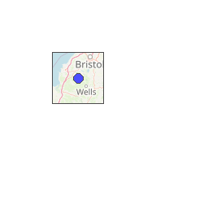
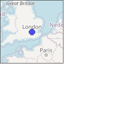
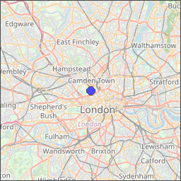
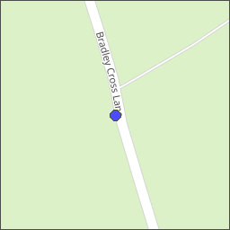
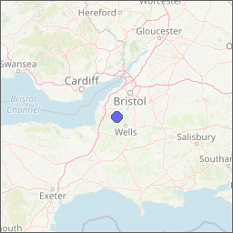
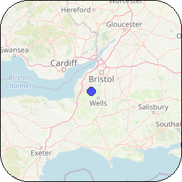
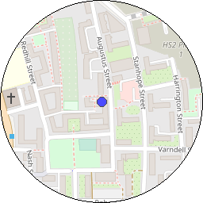
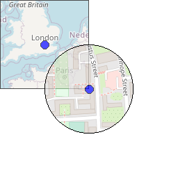

<!-- 

Auto Generated File DO NOT EDIT 

-->
# Moving Map

Shows a moving map, with the current GPS location at the centre of the map. The zoom level can be set to show a smaller
or larger surrounding area. 


```xml
<component type="moving_map" size="256" />
```
<kbd></kbd>


## Sizing

Moving map is always the same width as its height, use `size` to set the size


```xml
<component type="moving_map" size="64" zoom="7" />
```
<kbd></kbd>


## Positioning

Use `x` and `y` to set the position on screen


```xml
<component type="moving_map" x="64" y="64" size="64" zoom="7" />
```
<kbd></kbd>


## Zoom

Zoom levels can be set with `zoom`

Zoom levels range from 0 (the whole world) to 20 (a mid-sized building) - although not all
map providers will provide tiles for zoom levels 19 & 20. Zoom levels 18 and below should be widely supported.

For more information on zoom levels see: [Zoom Levels](https://wiki.openstreetmap.org/wiki/Zoom_levels) on the
OpenStreetMap wiki.


```xml
<component type="moving_map" size="128" zoom="4" />
```
<kbd></kbd>


```xml
<component type="moving_map" size="128" zoom="10" />
```
<kbd></kbd>


```xml
<component type="moving_map" size="128" zoom="17" />
```
<kbd></kbd>


## Opacity

Set the opacity using `opacity`. It defaults to 1.0 which is completely opaque. 0.0 would be completely transparent.
The gopro video will be visible through the component, if it is not completely opaque.


```xml
<component type="moving_map" zoom="7" opacity="0.6" />
```
<kbd></kbd>


## Rounded Corners

Corners can be rounded with `corner_radius`.


```xml
<component type="moving_map" size="128" corner_radius="40" />
```
<kbd></kbd>


if `corner_radius` == half the width (ie. the radius) then the corners will be so rounded that the map becomes a circle


```xml
<component type="moving_map" size="128" corner_radius="64" />
```
<kbd></kbd>


## Map Provider & Styles

The map provider, and the map style, can be selected using the command line arguments when running the dashboard program. 
Currently, it's not possible to have multiple different map styles and providers in the same dashboard.

It is possible to have multiple moving maps, though


```xml
<component type="moving_map" size="128" zoom="4" /> 
<component type="moving_map" x="64" y="64" size="128" corner_radius="64" zoom="16"/>
```
<kbd></kbd>

