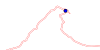
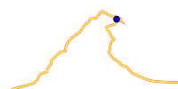
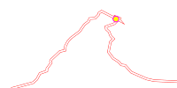
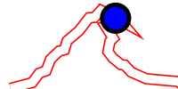
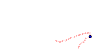

<!-- 

Auto Generated File DO NOT EDIT 

-->

# Cairo Circuit Map

_Requires Cairo to be installed_

Shows a simple plot of the path, but no map behind it...


```xml
<component type="cairo_circuit_map" size="256" />
```
<kbd></kbd>


# Colours

You can change the colours with

`fill`, `outline` for the path, and `loc-fill`, `loc-outline` for the "location" dot.


```xml
<component type="cairo_circuit_map" size="256" fill="255,255,0" outline="255,0,255" />
```
<kbd></kbd>


```xml
<component type="cairo_circuit_map" size="256" loc-fill="255,255,0" loc-outline="255,0,255" />
```
<kbd></kbd>


# Line width

You can change the line widths with `line-width` and `loc-size` - The numbers are relative to the size of the overall widget, so `1` 
means a line that is the whole width of the widget.

The map will be simplified to reduce the number of points as the line width increases.


```xml
<component type="cairo_circuit_map" size="256" line-width="0.05" loc-size="0.05" />
```
<kbd></kbd>


# Rotation

You can rotate the drawing with `rotate` and specify the clockwise rotation angle in degrees.


```xml
<component type="cairo_circuit_map" size="256" rotate="45" />
```
<kbd></kbd>

