<!-- 

Auto Generated File DO NOT EDIT 

-->

# Cairo Gauge Arc Annotated

_Requires Cairo to be installed_

Shows a round gauge, with a needle pointing to the current value of some metric. Additionally,
a sector of the display can show "high" and "low" values of some other metric, or a fixed range.

Any supported metric or unit can be used. The arc will only be drawn if a value or metric name is given for `arc-value-upper`.
If a metric name is given using `arc-metric-upper` then it will need to be convertible to the units of the gauge. The intended use for this,
is to allow (to be implemented) metric which is the moving average/max/min of a given metric.

The arc can be useful for target speed, cadence, power or altitude - using a value here for the lower and upper bound of the target range.


```xml
<component type="cairo-gauge-arc-annotated" metric="speed" units="mph"
            arc-value-lower="15" arc-value-upper="25" />
```
<kbd>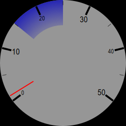</kbd>


# Size

Use `size` to change the size.

# Max and Min Values

Use `max` and `min` to set maximum and minimum values.


```xml
<component type="cairo-gauge-arc-annotated" metric="speed" units="mph" max="30" arc-value-upper="12" />
```
<kbd>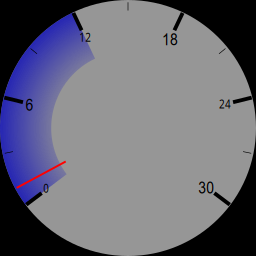</kbd>


# Rotation and Length

The gauge by default starts at the bottom left, this can be changed using `start`, which is the number of degrees to rotate clockwise. The default `start` is 143.


```xml
<component type="cairo-gauge-arc-annotated" metric="speed" units="mph"  start="270" arc-value-upper="25"/>
```
<kbd>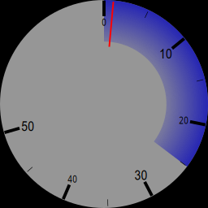</kbd>


The gauge is normally 254 degrees "long". This can be changed using `length`


```xml
<component type="cairo-gauge-arc-annotated" metric="speed" units="mph"  length="90" arc-value-upper="25" />
```
<kbd>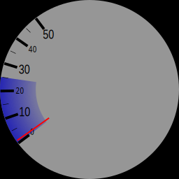</kbd>


```xml
<component type="cairo-gauge-arc-annotated" metric="speed" units="mph"  length="180" arc-value-upper="25" />
```
<kbd>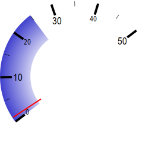</kbd>


# Number of Ticks / Sectors

There are 5 sectors by default. This can be changed with `sectors`


```xml
<component type="cairo-gauge-arc-annotated" metric="speed" units="mph"  length="90" sectors="20" arc-value-upper="25" />
```
<kbd>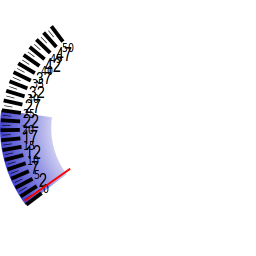</kbd>


```xml
<component type="cairo-gauge-arc-annotated" metric="speed" units="mph"  length="180" sectors="6" arc-value-upper="25" />
```
<kbd>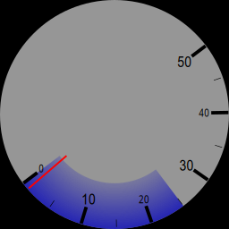</kbd>


# Colours

Various colours can be set, either as RGB, or RGBA values.

The following are available to change: `background-rgb`, `major-ann-rgb`, `minor-ann-rgb`, `needle-rgb`, `major-tick-rgb`, `minor-tick-rgb`


```xml
<component type="cairo-gauge-arc-annotated" metric="speed" units="mph"  background-rgb="255,0,0" arc-value-upper="25"/>
```
<kbd>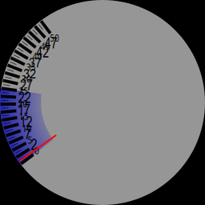</kbd>


```xml
<component type="cairo-gauge-arc-annotated" metric="speed" units="mph"  major-ann-rgb="255,0,0" arc-value-upper="25"/>
```
<kbd>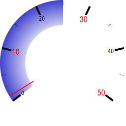</kbd>


```xml
<component type="cairo-gauge-arc-annotated" metric="speed" units="mph"  minor-ann-rgb="255,0,0" arc-value-upper="25"/>
```
<kbd>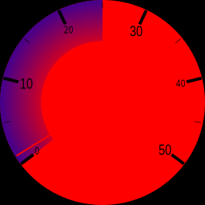</kbd>


```xml
<component type="cairo-gauge-arc-annotated" metric="speed" units="mph"  major-tick-rgb="255,0,0" arc-value-upper="25"/>
```
<kbd>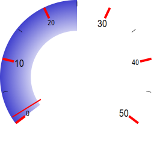</kbd>


```xml
<component type="cairo-gauge-arc-annotated" metric="speed" units="mph"  minor-tick-rgb="255,0,0" arc-value-upper="25"/>
```
<kbd></kbd>


```xml
<component type="cairo-gauge-arc-annotated" metric="speed" units="mph"  needle-rgb="255,0,255" arc-value-upper="25"/>
```
<kbd>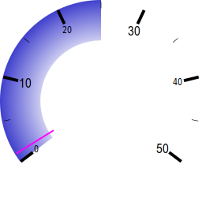</kbd>


```xml
<component type="cairo-gauge-arc-annotated" metric="speed" units="mph"  arc-inner-rgb="255,0,255,50" arc-outer-rgb="255,0,0,250" arc-value-upper="25"/>
```
<kbd>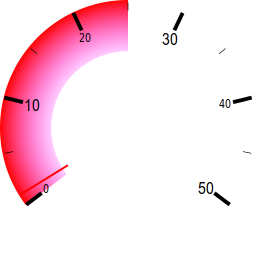</kbd>


# Transparency

Any colour that is completely transparent will disappear... this can be used to change the appearance of the widget quite a bit.


```xml
<component type="cairo-gauge-arc-annotated" metric="speed" units="mph"  background-rgb="255,0,0,0" arc-value-upper="25"/>
```
<kbd>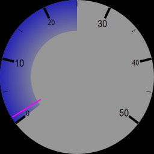</kbd>


```xml
<component type="cairo-gauge-arc-annotated" metric="speed" units="mph"  major-ann-rgb="255,0,0,0" arc-value-upper="25"/>
```
<kbd>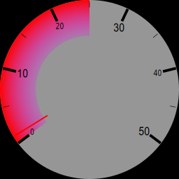</kbd>


```xml
<component type="cairo-gauge-arc-annotated" metric="speed" units="mph"  minor-ann-rgb="255,0,0,0" arc-value-upper="25"/>
```
<kbd>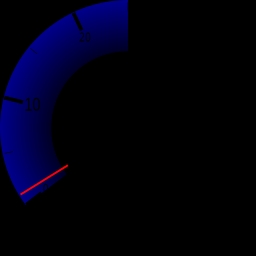</kbd>


```xml
<component type="cairo-gauge-arc-annotated" metric="speed" units="mph"  major-tick-rgb="255,0,0,0" arc-value-upper="25"/>
```
<kbd>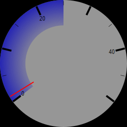</kbd>


```xml
<component type="cairo-gauge-arc-annotated" metric="speed" units="mph"  minor-tick-rgb="255,0,0,0" arc-value-upper="25"/>
```
<kbd>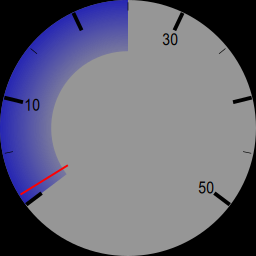</kbd>


```xml
<component type="cairo-gauge-arc-annotated" metric="speed" units="mph"  needle-rgb="255,0,255,40" arc-value-upper="25"/>
```
<kbd>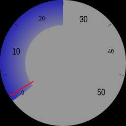</kbd>


# A Full Example

Here's an example of how to combine this with a metric to get a full speedometer


```xml
<translate x="0" y="0">
    <component type="cairo-gauge-arc-annotated" metric="speed" units="mph" start="90" size="250"/>
    <translate x="125" y="70">
        <component type="metric" metric="speed" units="mph" size="100" dp="0" rgb="255,255,255,160" outline="0,0,0,160" align="centre"/>
    </translate>
</translate>
```
<kbd>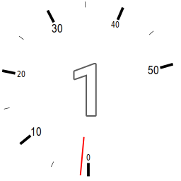</kbd>
