<!-- 

Auto Generated File DO NOT EDIT 

-->

# Cairo Gauge Marker

_Requires Cairo to be installed_

Shows a simple gauge, with a marker at the end, which gauges some metric.

Any supported metric or unit can be used


```xml
<component type="cairo-gauge-marker" metric="speed" units="mph" />
```
<kbd>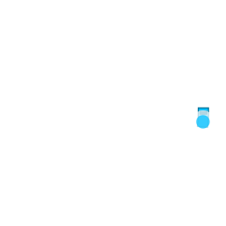</kbd>


# Max and Min Values

Use `max` and `min` to set maximum and minimum values.


```xml
<component type="cairo-gauge-marker" metric="speed" units="mph" max="3" />
```
<kbd>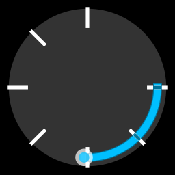</kbd>


# Rotation and Length

The gauge by default starts at the right, this can be changed using `start`, which is the number of degrees to rotate clockwise


```xml
<component type="cairo-gauge-marker" metric="speed" units="mph" max="3" start="90"/>
```
<kbd>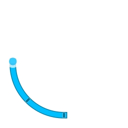</kbd>


The gauge is normally 270 degrees "long". This can be changed using `length`


```xml
<component type="cairo-gauge-marker" metric="speed" units="mph" max="3" length="90" />
```
<kbd>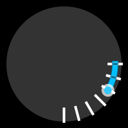</kbd>


```xml
<component type="cairo-gauge-marker" metric="speed" units="mph" max="3" length="180" />
```
<kbd>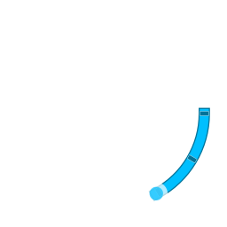</kbd>


# Number of Ticks / Sectors

There are 6 sectors by default. This can be changed with `sectors`


```xml
<component type="cairo-gauge-marker" metric="speed" units="mph" max="3" length="90" sectors="2" />
```
<kbd>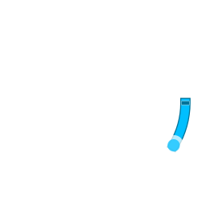</kbd>


```xml
<component type="cairo-gauge-marker" metric="speed" units="mph" max="3" length="180" sectors="3" />
```
<kbd></kbd>


# Colours

Various colours can be set, either as RGB, or RGBA values.

The following are available to change: `tick-rgb`, `background-rgb`, `gauge-rgb`, `dot-outer-rgb`, `dot-inner-rgb`

Changing the tick-colour will change the background colour so to get the desired effect it may be worth specifying both.


```xml
<component type="cairo-gauge-marker" metric="speed" units="mph" max="3" tick-rgb="255,0,0"/>
```
<kbd>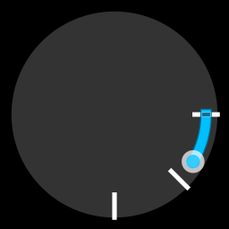</kbd>


```xml
<component type="cairo-gauge-marker" metric="speed" units="mph" max="3" background-rgb="255,0,0,100"/>
```
<kbd>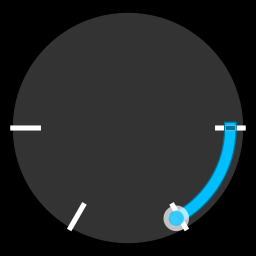</kbd>


```xml
<component type="cairo-gauge-marker" metric="speed" units="mph" max="3" gauge-rgb="255,0,0" />
```
<kbd>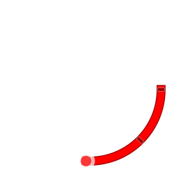</kbd>


```xml
<component type="cairo-gauge-marker" metric="speed" units="mph" max="3" dot-outer-rgb="255,0,0" />
```
<kbd>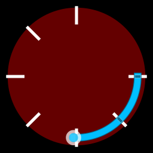</kbd>


```xml
<component type="cairo-gauge-marker" metric="speed" units="mph" max="3" dot-inner-rgb="255,0,0,128" />
```
<kbd>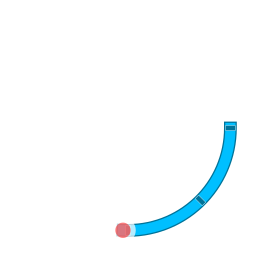</kbd>


