<!-- 

Auto Generated File DO NOT EDIT 

-->

# Cairo Gauge Round Annotated

_Requires Cairo to be installed_

Shows a gauge like a car speedometer, which gauges some metric.

Any supported metric or unit can be used


```xml
<component type="cairo-gauge-round-annotated" metric="speed" units="mph" />
```
<kbd></kbd>


# Size

Use `size` to change the size.

# Max and Min Values

Use `max` and `min` to set maximum and minimum values.


```xml
<component type="cairo-gauge-round-annotated" metric="speed" units="mph"  />
```
<kbd>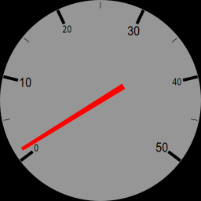</kbd>


# Rotation and Length

The gauge by default starts at the bottom left, this can be changed using `start`, which is the number of degrees to rotate clockwise. The default `start` is 143.


```xml
<component type="cairo-gauge-round-annotated" metric="speed" units="mph"  start="270"/>
```
<kbd>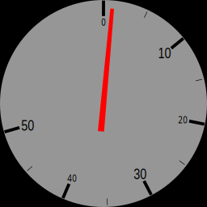</kbd>


The gauge is normally 254 degrees "long". This can be changed using `length`


```xml
<component type="cairo-gauge-round-annotated" metric="speed" units="mph"  length="90" />
```
<kbd>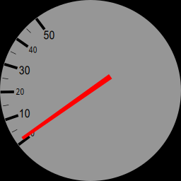</kbd>


```xml
<component type="cairo-gauge-round-annotated" metric="speed" units="mph"  length="180" />
```
<kbd>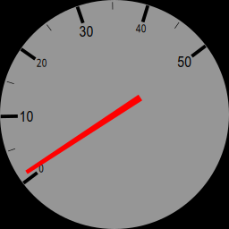</kbd>


# Number of Ticks / Sectors

There are 5 sectors by default. This can be changed with `sectors`


```xml
<component type="cairo-gauge-round-annotated" metric="speed" units="mph"  length="90" sectors="20" />
```
<kbd>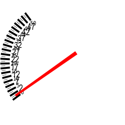</kbd>


```xml
<component type="cairo-gauge-round-annotated" metric="speed" units="mph"  length="180" sectors="6" />
```
<kbd>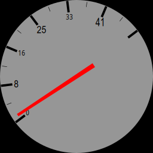</kbd>


# Colours

Various colours can be set, either as RGB, or RGBA values.

The following are available to change: `background-rgb`, `major-ann-rgb`, `minor-ann-rgb`, `needle-rgb`, `major-tick-rgb`, `minor-tick-rgb`


```xml
<component type="cairo-gauge-round-annotated" metric="speed" units="mph"  background-rgb="255,0,0"/>
```
<kbd>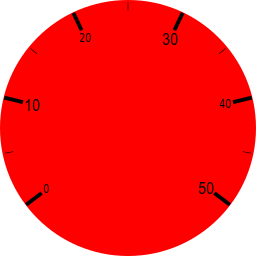</kbd>


```xml
<component type="cairo-gauge-round-annotated" metric="speed" units="mph"  major-ann-rgb="255,0,0"/>
```
<kbd></kbd>


```xml
<component type="cairo-gauge-round-annotated" metric="speed" units="mph"  minor-ann-rgb="255,0,0"/>
```
<kbd>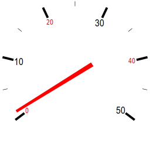</kbd>


```xml
<component type="cairo-gauge-round-annotated" metric="speed" units="mph"  needle-rgb="255,0,255"/>
```
<kbd>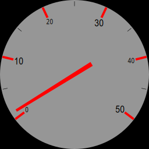</kbd>


```xml
<component type="cairo-gauge-round-annotated" metric="speed" units="mph"  needle-rgb="255,0,255"/>
```
<kbd>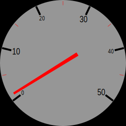</kbd>


```xml
<component type="cairo-gauge-round-annotated" metric="speed" units="mph"  major-tick-rgb="255,0,0"/>
```
<kbd></kbd>


```xml
<component type="cairo-gauge-round-annotated" metric="speed" units="mph"  minor-tick-rgb="255,0,0"/>
```
<kbd>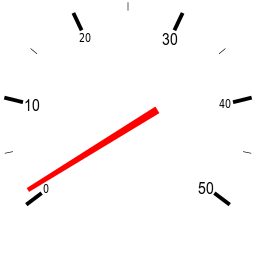</kbd>


# Transparency

Any colour that is completely transparent will disappear... this can be used to change the appearance of the widget quite a bit.


```xml
<component type="cairo-gauge-round-annotated" metric="speed" units="mph"  background-rgb="255,0,0,0"/>
```
<kbd>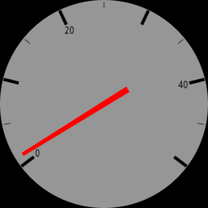</kbd>


```xml
<component type="cairo-gauge-round-annotated" metric="speed" units="mph"  major-ann-rgb="255,0,0,0"/>
```
<kbd>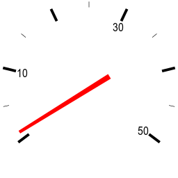</kbd>


```xml
<component type="cairo-gauge-round-annotated" metric="speed" units="mph"  minor-ann-rgb="255,0,0,0"/>
```
<kbd>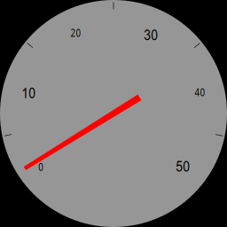</kbd>


```xml
<component type="cairo-gauge-round-annotated" metric="speed" units="mph"  needle-rgb="255,0,255,40"/>
```
<kbd>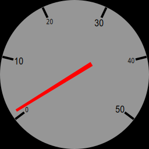</kbd>


```xml
<component type="cairo-gauge-round-annotated" metric="speed" units="mph"  major-tick-rgb="255,0,0,0"/>
```
<kbd>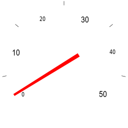</kbd>


```xml
<component type="cairo-gauge-round-annotated" metric="speed" units="mph"  minor-tick-rgb="255,0,0,0"/>
```
<kbd></kbd>


