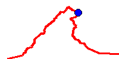

<!-- 

Auto Generated File DO NOT EDIT 

-->

# Circuit Map

Chows a simple plot of the path, but no map behind it...


```xml
<component type="circuit_map" size="256" />
```
<kbd></kbd>


# Colours

You can change the colours with

`fill`, and `outline`

# Line width

You can change the line widths with 

`fill_width` and `outline_width`


```xml
<component type="circuit_map" size="256" fill_width="10" outline_width="3" />
```
<kbd></kbd>


