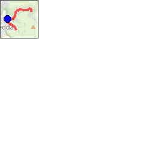
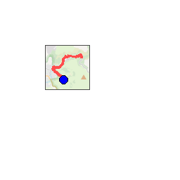
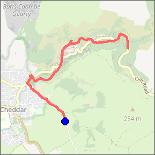
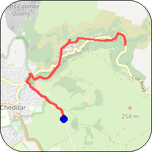
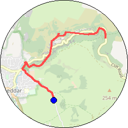
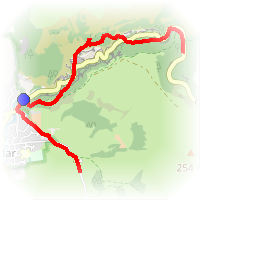

<!-- 

Auto Generated File DO NOT EDIT 

-->

# Journey Map

Shows an 'overall' journey map, with the entire GPS trace shown over a map. The map is scaled appropriately to fit the
entire journey.


```xml
<component type="journey_map" size="256" />
```
<kbd></kbd>


## Sizing

Moving map is always the same width as its height, use `size` to set the size


```xml
<component type="journey_map" size="64" />
```
<kbd></kbd>


## Positioning

Use `x` and `y` to set the position on screen


```xml
<component type="journey_map" x="64" y="64" size="64" />
```
<kbd></kbd>


## Opacity

Set the opacity using `opacity`. It defaults to 1.0 which is completely opaque. 0.0 would be completely transparent.
The gopro video will be visible through the component, if it is not completely opaque.


```xml
<component type="journey_map" opacity="0.6" />
```
<kbd></kbd>


## Rounded Corners

Corners can be rounded with `corner_radius`.


```xml
<component type="journey_map" size="256" corner_radius="40" />
```
<kbd></kbd>


if `corner_radius` == half the width (ie. the radius) then the corners will be so rounded that the map becomes a circle


```xml
<component type="journey_map" size="256" corner_radius="128"/>
```
<kbd></kbd>


## Fade out

Corners can be faded out using parent frame's `fo` where you can specify how many pixels to use for the fade out.


```xml
<frame width="200" height="200" bg="255,255,255">
    <frame width="200" height="200" cr="50" fo="40">
      <component type="journey_map" size="200"/>
    </frame>
</frame>
```
<kbd></kbd>


## Copyright

All maps are © OpenStreetMap contributors

Please see Copyright https://www.openstreetmap.org/copyright


