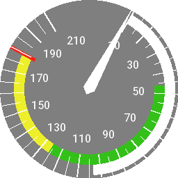
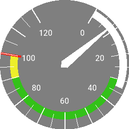
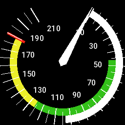
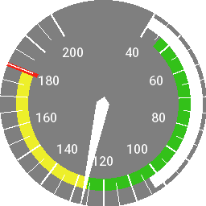
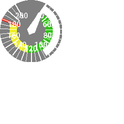
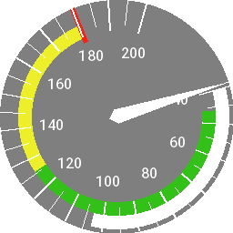

<!-- 

Auto Generated File DO NOT EDIT 

-->
# Air Speed Indicator

** Experimental **

The Air Speed Indicator component draws an air speed indicator.

The best speed indicator that exists at the moment is `speed`, but this does represent
the SOG or Groundspeed, not airspeed, but it might be OK for a video overlay.


```xml
<component type="asi" vs0="10" />
```
<kbd></kbd>


# Critical Airspeed Indicators

The following attributes can be set to change the critical air speed indicators.

More accurate definitions are welcomed!

| Attribute | Description                                                  | 
|-----------|--------------------------------------------------------------|
| vs0       | Stall speed with flaps extended in landing configuration Vs0 |
| vs | Stall speed in pre-defined configuration Vs                  |
| vfe | Maximum flap extension speed Vfe                             |
| vno | Max structural cruising speed                                | 
| vne | Never Exceed speed                                           | 


```xml
<component type="asi" vs0="0" vs="30" vfe="33" vno="90" vne="100" />
```
<kbd></kbd>


This could work also for a recording in a yacht? The meanings of the parameters would be changed somehow, but it might look good?

# Metrics & Conversions

The ASI defaults to speed in knots, but like a text metric, can access any available information, and convert it to
other units


```xml
<component type="asi" units="mph" vs0="10" />
```
<kbd></kbd>


```xml
<component type="asi" metric="alt" units="feet" />
```
<kbd></kbd>


# Size

The component can be sized - sizes that are too small or big might not render quite right


```xml
<component type="asi" size="128" />
```
<kbd></kbd>


# Font

The text font can be changed in size


```xml
<component type="asi" textsize="24" />
```
<kbd></kbd>

