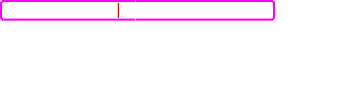
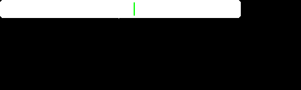
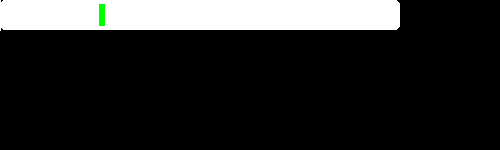

<!-- 

Auto Generated File DO NOT EDIT 

-->
<!-- Dimension(500,150) -->
# Bar

Draws a very simple horizontal bar with current metric value


```xml
<component type="bar" metric="accl.x" units="m/s^2" />
```
<kbd></kbd>


## Positioning

Place the bar component inside a `translate` to move it around

## Size

Use `width` and `height` to control the size of the component, in pixels


```xml
<component type="bar" width="100" height="100" metric="speed" units="kph" />
```
<kbd></kbd>


## Colours

Use `fill` and `outline` to change the fill and outline colours

Specify the colours, as usual, in r,g,b or r,g,b,a


```xml
<component type="bar" metric="accl.y" units="m/s^2" fill="255,255,255,128" />
```
<kbd></kbd>


```xml
<component type="bar" metric="accl.y" units="m/s^2" outline="255,0,255" />
```
<kbd></kbd>


To get rid of the outline completely, specify an alpha of `0`


```xml
<component type="bar" metric="accl.y" units="m/s^2" outline="255,0,255,0" />
```
<kbd></kbd>


Use `zero` to change the colour of the zero marker


```xml
<component type="bar" metric="accl.y" units="m/s^2" zero="255,0,255" />
```
<kbd></kbd>


Use `bar` to change the colour of the bar itself


```xml
<component type="bar" metric="accl.y" units="m/s^2" bar="255,0,255" />
```
<kbd></kbd>


Use `h-neg` and `h-pos` as rgba values to control the highlight colours of ends of the bar


```xml
<component type="bar" metric="accl.y" units="m/s^2" h-neg="255,0,255" />
```
<kbd></kbd>


```xml
<component type="bar" metric="accl.y" units="m/s^2" h-pos="255,0,255" />
```
<kbd></kbd>


## Outline Width

Use `outline-width` to control the width of the outline


```xml
<component type="bar" metric="accl.y" units="m/s^2" outline-width="3" />
```
<kbd></kbd>


## Max & Min Values

Use `max` and `min` to control the max and min values that the bar will display


```xml
<component type="bar" metric="accl.y" units="m/s^2" max="5" min="-1" />
```
<kbd></kbd>


```xml
<component type="bar" metric="accl.y" units="m/s^2" max="10" min="0" />
```
<kbd></kbd>


## Centered bar

Use `align_center="true"` to center the bar around zero (the middle). This can be useful for progress bars or similar. The `h-neg` and `h-pos` properties are not used or displayed in this mode. **Tip:** set color properties to `0,0,0,0` to hide them. You will probably want to hide `fill`, `outline`, and `zero` for a progress bar.


## Example Composite Bar Component

For example to plot acceleration values for all three axes


```xml
<composite>
        <translate y="0">
          <component type="bar" width="400" height="50" metric="accl.x"/>
          <component type="text" x="10" y="10" size="24" rgb="255,255,255">X Accl</component>
          <component type="metric" x="200" y="15" metric="accl.x" size="24" rgb="255,255,255" dp="2" align="centre" />
        </translate>
        <translate y="50">
            <component type="bar" width="400" height="50" metric="accl.y" />
            <component type="text" x="10" y="10" size="24" rgb="255,255,255">Y Accl</component>
            <component type="metric" x="200" y="15" metric="accl.y" size="24" rgb="255,255,255" dp="2"  align="centre"/>
        </translate>
        <translate y="100">
            <component type="bar" width="400" height="50" metric="accl.z" />
            <component type="text" x="10" y="10" size="24" rgb="255,255,255">Z Accl</component>
            <component type="metric" x="200" y="15" metric="accl.z" size="24" rgb="255,255,255" dp="2" align="centre"/>
        </translate>
    </composite>
```
<kbd></kbd>

