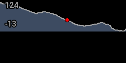
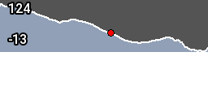
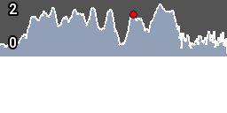
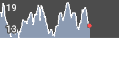
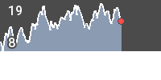
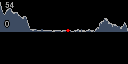
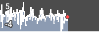
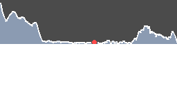
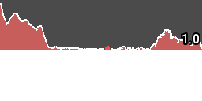
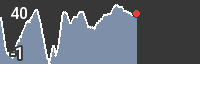

<!-- 

Auto Generated File DO NOT EDIT 

-->

# Chart

Chart draws a chart of some metric, with a configurable window before and after the current point.

The default metric is `alt`, with a default window of `5` minutes (2.5 mins around the current point in each direction)


```xml
<component type="chart" name="chart" />
```
<kbd></kbd>


The component used to be called 'gradient_chart', and type `gradient_chart` will still work, but is now deprecated and may be removed in 
a future version.


```xml
<component type="gradient_chart" name="chart" />
```
<kbd></kbd>


## Positioning

use `x` and `y` to set the position of the chart


```xml
<component type="chart" name="gradient_chart" x="100" />
```
<kbd></kbd>


# Window Size

Set the window size in seconds, defaults to 5*60 = `300`.

Smaller windows have a bit more of a scroll effect, so look nicer.


```xml
<component type="chart" metric="speed" units="kph" seconds="30" />
```
<kbd></kbd>


```xml
<component type="chart" metric="speed" units="kph" seconds="60" />
```
<kbd></kbd>


```xml
<component type="chart" metric="speed" units="kph" seconds="90" />
```
<kbd></kbd>


# Metric & Units

Use any standard metric, with any standard unit. See [04-metrics](../04-metrics) for more details


```xml
<component type="chart" metric="speed" units="kph" />
```
<kbd></kbd>


```xml
<component type="chart" metric="accl.x" units="m/s^2" />
```
<kbd></kbd>


## Colours / Sizing

Set the height using `height`


```xml
<component type="chart" height="100" />
```
<kbd></kbd>


Set colours using `bg`, `fill`, `line` and `text`. These can be "r,g,b", or "r,g,b,a".


```xml
<component type="chart" bg="255,255,0" fill="0,255,255" line="255,0,255" text="0,0,255" />
```
<kbd></kbd>


Set alpha/transparency using `alpha`, between 0 and 255.


```xml
<component type="chart" alpha="20" />
```
<kbd></kbd>


```xml
<component type="chart" alpha="200" />
```
<kbd></kbd>

