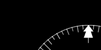
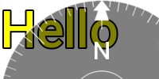
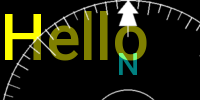

<!-- 

Auto Generated File DO NOT EDIT 

-->
# Compass

**Experimental**

The `compass` component draws a compass, rotated to the current heading.


```xml
<component type="compass" size="250" />
```
<kbd></kbd>


## Positioning

Compass does not support `x` and `y` co-ordinates. Put `compass` inside a `translate` to move it around


```xml
<translate x="50" y="50">
<component type="compass" size="250"/>
</translate>
```
<kbd></kbd>


## Colours

Colours can be controlled with `fg`, `bg` and `text` attributes


```xml
<component type="compass" size="100" fg="128,128,128"/>
```
<kbd></kbd>
 
```xml
<component type="compass" size="100" bg="128,128,128"/>
```
<kbd></kbd>
 
```xml
<component type="compass" size="100" text="128,128,255"/>
```
<kbd></kbd>


## Fonts

Text size can be controlled with the `textsize` attribute


```xml
<component type="compass" size="100" textsize="8"/>
```
<kbd></kbd>


```xml
<component type="compass" size="100" textsize="32"/>
```
<kbd></kbd>


## Transparency

By default the `bg` is fully transparent


```xml
<component type="text" size="64" rgb="255,255,0">Hello</component>
<component type="compass" size="256" textsize="32"/>
```
<kbd></kbd>


```xml
<component type="text" size="64" rgb="255,255,0">Hello</component>
<component type="compass" size="256" textsize="32" bg="0,0,0"/>
```
<kbd></kbd>


To make it partially transparent, use a `frame`, with `cr` (corner radius) set appropriately


```xml
<component type="text" size="64" rgb="255,255,0">Hello</component>
<frame width="256" height="256" opacity="0.3" cr="128">
<component type="compass" size="256" textsize="32" bg="0,0,0"/>
</frame>
```
<kbd></kbd>


