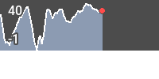
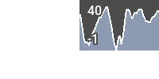

<!-- 

Auto Generated File DO NOT EDIT 

-->
# Gradient Chart

Notice: This component is poorly-named and will be modified in a future release.

Gradient chart draws a chart of the _altitude_ metric., with a window of 5 minutes before and after the current point.


```xml
<component type="gradient_chart" name="gradient_chart" />
```
<kbd></kbd>


## Positioning

use `x` and `y` to set the position of the chart


```xml
<component type="gradient_chart" name="gradient_chart" x="100" />
```
<kbd></kbd>
