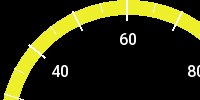
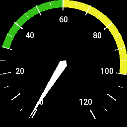
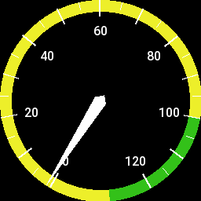
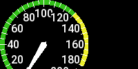
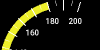
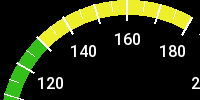
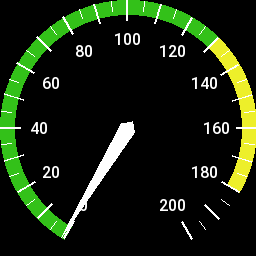
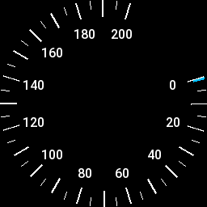
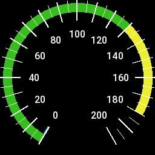
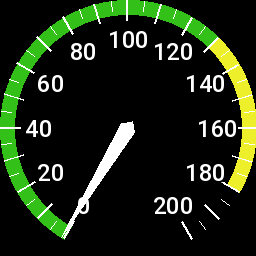

<!-- 

Auto Generated File DO NOT EDIT 

-->

# Motor Speed Indicator

The Motor Speed Indicator component draws a circular speed indicator


```xml
<component type="msi" end="100" />
```
<kbd></kbd>


# Sections

The following sections can be set 

| Attribute | Description        | 
|-----------|--------------------|
| green     | Green Section Max  |
| yellow    | Yellow Section Max |
| end       | End of Dial        |


```xml
<component type="msi" green="30" yellow="60" end="100" />
```
<kbd></kbd>


# Metrics & Conversions

The MSI defaults to speed in knots, but like a text metric, can access any available information, and convert it to
other units


```xml
<component type="msi" units="mph" end="100" />
```
<kbd></kbd>


```xml
<component type="msi" metric="alt" units="feet" />
```
<kbd></kbd>


# Size

The component can be sized - sizes that are too small or big might not render quite right


```xml
<component type="msi" size="128" />
```
<kbd></kbd>


# Rotation

Can rotate the entire gauge clockwise using `rotate`


```xml
<component type="msi" rotate="45" />
```
<kbd></kbd>


```xml
<component type="msi" rotate="90" />
```
<kbd></kbd>


```xml
<component type="msi" rotate="180" />
```
<kbd></kbd>


# Needle or no needle

The MSI component has a needle-less form which has a different style


```xml
<component type="msi" needle="no" rotate="45" />
```
<kbd></kbd>


# Variant

The MSI component has a variant "msi2", which doesn't have a needle, it has the same other attributes 
`green`, `yellow`, `end`


```xml
<component type="msi2" />
```
<kbd></kbd>


# Font

The text font can be changed in size


```xml
<component type="msi" textsize="24" />
```
<kbd></kbd>


