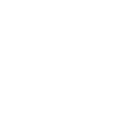
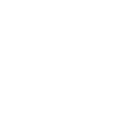
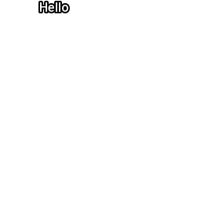
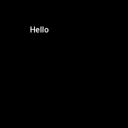
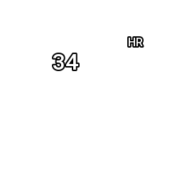
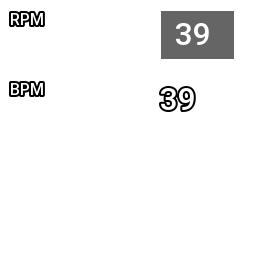

<!-- 

Auto Generated File DO NOT EDIT 

-->
# Translate

Translate is a __container__ and can contain other components.

The `translate` component moves its child elements around on the screen. For example, the `compass` component doesn't
take an x/y co-ordinate to indicate where it should be drawn on the screen, so by default it will draw at (0,0) - the
top-left of the screen. By placing the `compass` inside a `translate` the compass can be drawn anywhere on the screen


```xml
<component type="compass" size="250" />
```
<kbd></kbd>


```xml
<translate x="50">
    <component type="compass" size="250" />
</translate>
```
<kbd></kbd>


# Children

Any number of children can be placed inside a `translate`.
Any child components that specify their own location, will be *relative* to the `translate` co-ordinates


```xml
<component type="text" x="50">Hello</component>
```
<kbd></kbd>


```xml
<translate x="10" y="50">
    <component type="text" x="50">Hello</component>
</translate>
```
<kbd></kbd>


# Naming

Optionally, any container component can be named, this allows you to include or exclude it for a given rendering run on
the command line Names don't have to be unique, so a dashboard could have a number of different containers all named "
with-hr", which could be excluded when rendering a GPX track that doesn't have any heartrate data in it.


```xml
<translate name="with-hr" x="180" y="50">
    <component type="text">HR</component>
    <component type="metric" x="-70" y="18" metric="hr" dp="0" size="32" align="right"/>
</translate>
```
<kbd></kbd>


If you didn't want to render the metric and the text, you could add `--exclude with-hr` when running the program, and
this container would be skipped.

# Composite

To use only the `name` feature of `translate`, it is also possible to refer to `translate` as `composite`. It will have the same effect, but
might be less confusing, as it won't be translating anything.


```xml
<composite name="with-gpx">
     <translate x="10" y="10" name="with-rpm">
        <component type="text" x="0" y="0" size="16" >RPM</component>
        <component type="icon" x="64" y="0" file="gauge.png" size="64"/>
        <translate x="150">
         <frame width="75" height="50" bg="0,0,0" outline="255,255,255" opacity="0.6">
            <component type="metric" x="15" y="5" metric="alt" dp="0" size="32"/>
        </frame>
        </translate>
    </translate>
    <translate x="10" y="64" name="with-hr">
        <component type="text" x="0" y="128" size="16" >BPM</component>
        <component type="icon" x="64" y="128" file="heartbeat.png" size="64"/>
        <component type="metric" x="150" y="128" metric="alt" dp="0" size="32"/>
    </translate>
</composite>
```
<kbd></kbd>

