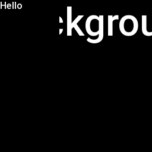
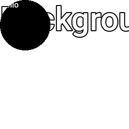
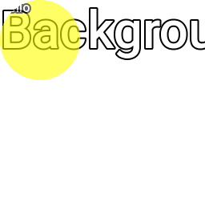
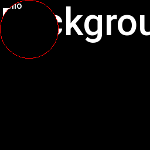
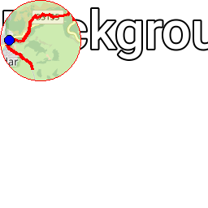

<!-- 

Auto Generated File DO NOT EDIT 

-->

# Frame

Frame is a __container__ and can contain other components.

The `frame` component will clip its children to the given frame size, and
draw them, optionally with an outline, rounding, background, and opacity into the dashboard.

Some examples might make this clearer.

The `outline` and `bg` parameters can also accept a "colour-with-alpha" (r,g,b,a) to allow a bit more
more control over the transparency of the various bits.


```xml
<component type="text" size="64">Background</component>
<frame width="100" height="100">
  <component type="text">Hello</component>
</frame>
```
<kbd></kbd>


```xml
<component type="text" size="64">Background</component>
<frame width="100" height="100" cr="50">
  <component type="text">Hello</component>
</frame>
```
<kbd></kbd>


```xml
<component type="text" size="64">Background</component>
<frame width="100" height="100" cr="50" bg="255,255,0" opacity="0.6">
  <component type="text">Hello</component>
</frame>
```
<kbd></kbd>


```xml
<component type="text" size="64">Background</component>
<frame width="100" height="100" cr="50" outline="255,0,0">
  <component type="text">Hello</component>
</frame>
```
<kbd></kbd>


```xml
<component type="text" size="64">Background</component>
<frame width="100" height="100" cr="50" outline="255,0,0">
  <component type="journey_map" size="100"/>
</frame>
```
<kbd></kbd>


